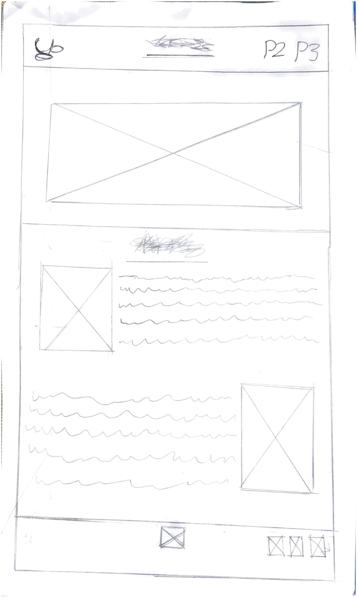

# Your New Website 🤩

Oh hi! Welcome to your new website. 🛼

With this project you can make a website and preview it in your browser, then deploy it for free – you don't even need a host!

**In this guide we'll learn how to deploy your project to <a href="https://www.fastly.com/products/edge-compute" target="_blank">Fastly Compute</a> – your deployment will automatically handle things like 404 errors, and your beautiful website will immediately be available for everyone, everywhere all at once. 🪄**

> You can alternatively deploy your blog to other platforms, like <a href="https://pages.github.com/" target="_blank">GitHub Pages</a>.

## In this doc

* [Fork your own site](#fork-your-own-site)
* [Get to know your website](#get-to-know-your-website)
  * [Share your draft site](#share-your-draft-site)
* [Deploy your site to Fastly Compute](#deploy-your-site-to-fastly-compute)
* [Save your edits to GitHub](#save-your-edits-to-github)
* [How this project works](#how-this-project-works-)
  * [Extensions](#extensions)
* [Keep going! 🚀](#keep-going-)

## Fork your own site

**Fork** [this repository](https://github.com/glitchdotcom/website-to-compute/) to create your own copy of the site.

In your fork, open the site in a codespace by clicking **Code** > **Codespaces** and creating a new codespace on your main branch. 

 

Give the codespace a minute or two to start up – it'll automatically build and preview your new website! 

* When your website preview opens, click the **🔎 Split** button at the bottom so that you can see the site side by side with your code.
* _You can close [x] the **Terminal** while you work._

Make sure you [save your changes to GitHub](#save-your-edits-to-github).

## Get to know your website

You can make edits in the files by opening them from the left sidebar. Your website preview will update as you edit!

💡 Try opening `index.html` and making a change.

🎨 Change your site style rules in `style.css`.

🖼️ Add images in the `public` folder – you'll find an example of including an image in the HTML.

> 🚨⚠️ Danger zone: There are directories in the project that might break your site... 😱😈
>
> * The `.devcontainer` folder includes the configuration that creates the experience in your codespace.
> * The `helpers` folder contains some bash scripts that run when your project starts and when you hit the **🚀 Publish** button.

### Share your draft site 

You can share links to your draft site with collaborators – click **🔗 Share** at the bottom of the editor. The terminal output will include a link you can right-click and copy to share with anyone you like! 

> This project includes a handy shortcut button for grabbing your preview URL but it might be a wee bit error prone 😅 you can also access these details in **💻 Terminal** > **PORTS** or by clicking the little Forwarded Ports icon: 
>
> Change `private` to `public` by right-clicking your running port and choosing from the options.
>
> Copy the URL to your clipboard and share it 📋.

## Deploy your site to Fastly Compute

Ready to unveil your site to the world? Deploy it to Fastly!

Grab a Fastly API key from your account and add it to your GitHub repo:

- Sign up for a <strong><a href="https://www.fastly.com/signup/" target="_blank">free Fastly developer account</a></strong>
- Grab an **API Token** from **Account** > **API Tokens** > **Personal Tokens** > **Create Token**
  - _Type_: Automation
  - _Role_: Engineer
  - _Scope_: Global (deselect the _Read-only access_ box)
  - _Access_: All services
  - _Expiration_: Never expire
- **Copy the token value into GitHub**
  - Back in your codespace, click into the textfield at the top of the editor and type `>` to access the command palette
  - Type `secret` and select **Codespaces: Manage user secrets**
    - 
  - Click **+ Add a new secret**
    - 
  - Enter the name `FASTLY_API_TOKEN`
    - 
  - Paste your token value and enter

In the notifications area at the bottom right of your codespace, you should see a prompt to **reload** for the new environment variable, so go ahead and click that (otherwise click the little bell 🔔 icon to check for the message).

Hit the **🚀 Publish** button at the bottom of the editor, enter `y` and watch the **Terminal** output for your new site address! It might take a couple of minutes... 🥁

You'll see your new `*.edgecompute.app` address in the output. Open it in a new tab and tell everyone you know about your new site. 📣

🎢 Whenever you update your content, hit the **🚀 Publish** button again to go live!

## Save your edits to GitHub

GitHub will keep the edits you make in the codespace only for a limited time, so it's a good idea to commit your work to a repo regularly. Use the **Source Control** button on the left of the editor – you can make commits, open and merge pull requests right inside the codespace. 

> GitHub will notify you if any of your codespaces are about to expire. If you have changes you want to keep, you can use the **Export changes to a branch** option.
> 
> 

## How this project works 🧐

This project uses the <a href="https://github.com/fastly/compute-js-static-publish" target="_blank">Fastly JavaScript Static Publisher</a> to turn your blog into a serverless app that runs at the network edge, near your users. 

* The project uses [Vite](https://vite.dev/) to build your site for deployment, placing files in the `deploy/_site` folder.
* The Static Publisher uses those files to scaffold a Compute app that compiles into Webassembly (Wasm) to run fast and securely on the Fastly network – you'll find the Compute code in `deploy/_app` after you deploy.
* When you publish, the project deploys the app to Fastly, creating a service and uploading the Wasm to it.
* It then then publishes your content to a KV Store – a key-value store that also runs on Fastly and that your app can talk to.

_The app itself only needs deployed to Fastly once, when you click the **🚀 Publish** button after that, we just update the content in your KV Store and your Compute app will pull your assets from there._

📝 Your Fastly service and KV Store will include your GitHub username and repo in their names, so you'll only be able to deploy one Compute app per repo unless you tweak the scripts.

⚙️ The settings we use to create the guided experience in the codespace are in the `.devcontainer/` folder.

🧰 You'll find the Fastly CLI commands we use under the hood in the `helpers/publish.sh` script.

💻 If you check the right-hand side of the **Terminal** you'll find multiple processes – this is to run the vite and Fastly commands.

### Extensions

This project uses the following extensions from the dev community! 🙌

* [VSCode Action Buttons Ext](https://marketplace.visualstudio.com/items?itemName=jkearins.action-buttons-ext)
* [ESLint](https://marketplace.visualstudio.com/items?itemName=dbaeumer.vscode-eslint)

## Keep going! 🛸

**Don't stop there, <a href="https://www.fastly.com/documentation/solutions/tutorials/deliver-your-site/#sending-domain-traffic-to-fastly" target="_blank">add a domain to your new site</a>.**

You'll find your service in your Fastly account control panel – check out the **Observability** stats! 📊

Check out more tips on using the <a href="https://github.com/fastly/compute-js-static-publish" target="_blank">Static Publisher</a> in its `README`. Note that if you change the Compute code, you'll need to run a separate deploy command to push your changes to Fastly as the **🚀 Publish** button only deploys once, after that it just updates your KV content.

🛟 Get help on the <a href="https://community.fastly.com" target="_blank">community forum</a>.

Relection

 This project overall was extremely interesting and benefited me in many ways, giving me more information about coding and design. One thing I learnt the most about in this assignment was CSS as this was my first time using it and it was interesting adjusting and using it to make certain aspects of my website, such as my first challenge making an interactive logo. In which I wanted an image to be a button that would lead to my main page this also had other challenges that came with it as I had to make a Nav bar in my CSS and section things off so I could control each aspect of it, like centring and making one left right or in the centre. Now the next difficulty I faced in this assignment was the slideshow in which was the first time I also used JavaScript. This was tricky as it was confusing going back and forth between JavaScript and CSS and html trying to figure out what to do but overall wasn’t the worst I opted to do a slide show instead of a scrollbar as I have previously had difficulties with using a scroll bar in html. As well as after hearing other people demonstrate their work, I saw the slide show and thought it was a really good idea and would fit the concept and goal of my website. Other small technical difficulties and other things I opted for was making the footer header and Navigation Bar Move with the website, which was extremely rewarding while not being that difficult as it really made the website feel much more well-made and cleaner to use. It felt like a huge changed that completely changed the feel of the website. Desinging the Website with a design in mind was a much more, different expreince to my last and really showed me certin differences in how making it felt. As the first time I was somewhat just writing code and putting unesseery stuff in to test out all the features, while this was much more directed to make, as I knew what things needed to be in the finished product.

----- Low-Fidelity Page 1/Home Prototype

----- Low-Fidelity Page 2 Prototype.

---- 1st Page/home/index of Website

----- 2nd Page of Website

 
Comparsion 

Comparison
Overall, a lot of the aspects I wanted for my website, where kept but they were rearranged and changed compared to the original. Such as Interactive Logo Home page on top left with name centre and Pages on the right. Where all accomplished. With my Header not being interactive. My body on page 1 accomplished what I wanted with a image to the right with text next to. My Footer has been completed altered with me using it as a reference to whole made it (me). Now the 2nd page had the most changes as what I wanted was not accomplishable and extremely difficult to do, so I opted for a much simpler way of presentation, by using a slide show to give information on different types of teas.

------ Page 1/index/home HTML5 Checker

------ Page 2/Page 1.html HTML5 Checker

Refrence List

This helped me in creating the slide show
https://www.w3schools.com/howto/howto_js_slideshow.asp